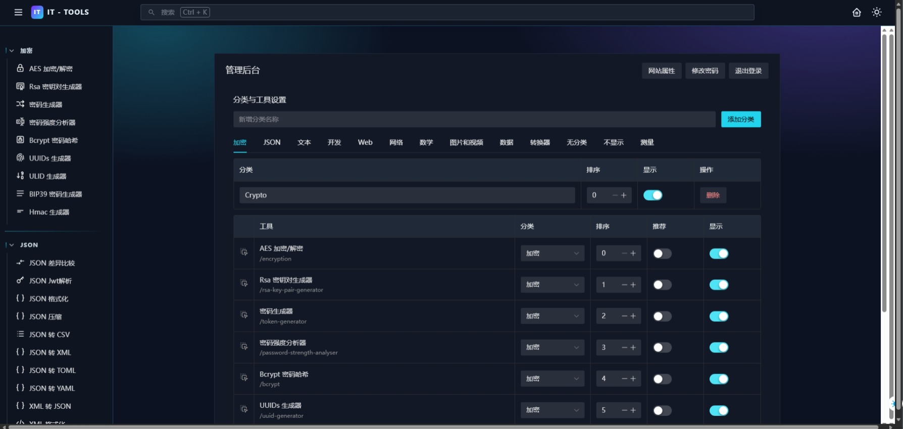
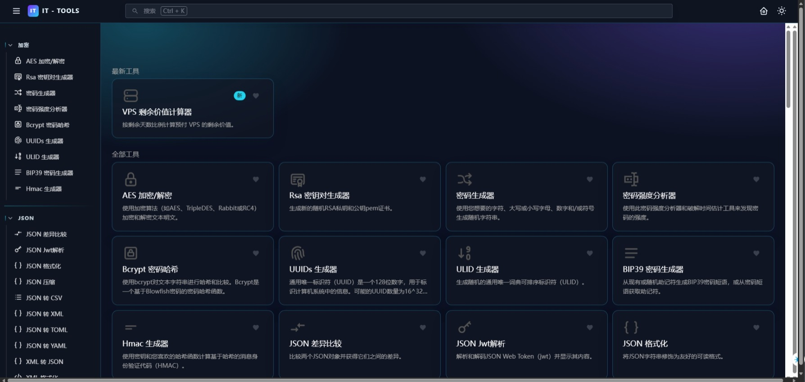
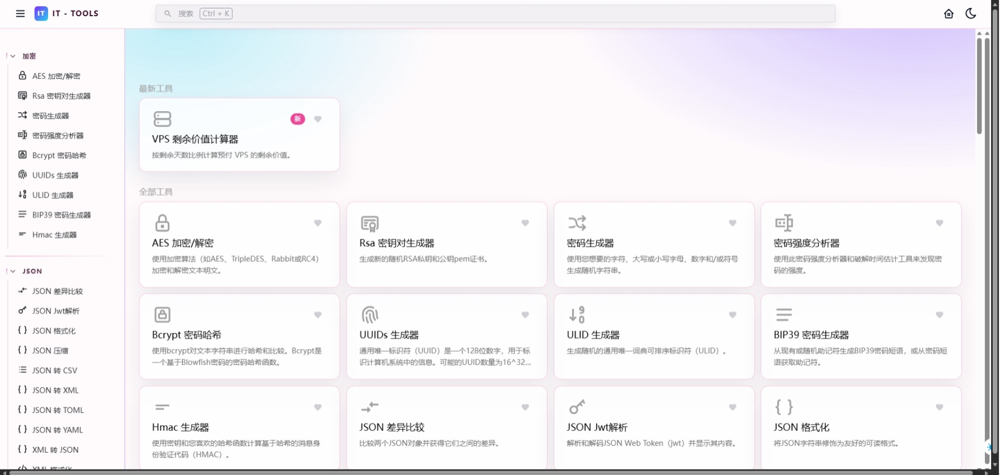

# Woodll Tools

面向开发者与 IT 从业者的在线工具箱，基于 IT-Tools 深度修改。

## 预览







## 与原版 IT-Tools 的主要差异

基于上游项目（CorentinTh/it-tools），本项目新增与调整如下：

- **新增 VPS 剩余价值计算器**
  - 支持续费金额、付费周期（年/三年/半年/季/月）、交易日期/到期日期、溢价百分比
  - 结算币种/支付币种切换，实时汇率参考与手动汇率
  - 生成并分享 **SVG 结果图**，支持预览
- **新增后台管理服务（Node）**
  - 站点配置（标题、描述、图标、Canonical）
  - 工具管理（启用/隐藏、排序、分类）
- **分享 SVG 结果图**
  - 后端生成并保存到 `data/uploads`
  - 前端一键复制 `` 分享代码
- **结果卡片展示增强**
  - 展示“剩余金额 + 溢价”的分解与汇总
  - 显示当前站点域名
- **全新浅色、深色 UI**
- **99% 汉化**
- **新增工具**
  - PNG 转 ICO
  - IPv4 查看本机 IP
  - JSON 差异比较
  - 编码转换
  - 正则表达式
- **性能优化**

上游项目更多说明请参考原仓库 README。

## 快速开始

### 安装依赖

```sh
pnpm install
```

### 启动前端

```sh
pnpm run dev
```

默认地址：`http://localhost:5173/`（或控制台输出的端口）

### 启动后台（管理 + SVG 生成）

```sh
pnpm run admin:server
```

默认地址：`http://localhost:3001/`

## 管理后台

- 访问：`/admin`
- 默认账号：`admin`
- 默认密码：`admin123`

生产环境请通过环境变量覆盖：

```sh
ADMIN_USERNAME=admin
ADMIN_PASSWORD=your-strong-password
ADMIN_JWT_SECRET=your-secret
```

## 主要后端接口（Node）

- `GET /api/tools-config` 工具配置
- `PUT /api/tools-config` 更新工具配置
- `GET /api/site-config` 站点配置
- `PUT /api/site-config` 更新站点配置
- `POST /api/vps-remaining-value/svg` 生成 SVG（响应 SVG 内容）
- `POST /api/vps-remaining-value/svg/save` 生成并保存 SVG，返回可访问 URL

## 构建

```sh
pnpm build
```

## 部署要点

- 确保 `data/` 与 `data/uploads/` 可写
- `admin:server` 建议放到反向代理后（如 Nginx）

## License

[GNU GPLv3](LICENSE)
